# 🚀 Enterprise CI/CD Platform for a Three-Tier Web Application


A production-style CI/CD platform deployed on **AWS EC2**, featuring **Jenkins**, **SonarQube**, **Docker**, **Amazon ECR**, and a self-managed **Kubernetes cluster (Kubespray)** for fully automated, zero-downtime software delivery.

---

## 📌 The Problem

A software company deploying applications manually was facing deployment delays, inconsistent environments across servers, and production outages caused by human error. They needed a fully automated software delivery pipeline built on DevOps best practices — not just a script that runs a few commands, but a real CI/CD platform with code quality gates, security scanning, and safe, observable deployments.

## 🎯 What This Project Does

This project builds that platform end-to-end: source code pushed to GitHub automatically triggers Jenkins, which runs static code analysis and security checks through SonarQube, builds versioned multi-stage Docker images, pushes them to a private Amazon ECR registry, and deploys them to a self-managed Kubernetes cluster — with rolling updates, health checks, and instant rollback, all with zero manual intervention.

The application itself (a three-tier Todo app — React + Node.js/Express + MySQL) is intentionally simple. The point of this project is the **pipeline and infrastructure**, not the app.

---

# 🏗 Architecture

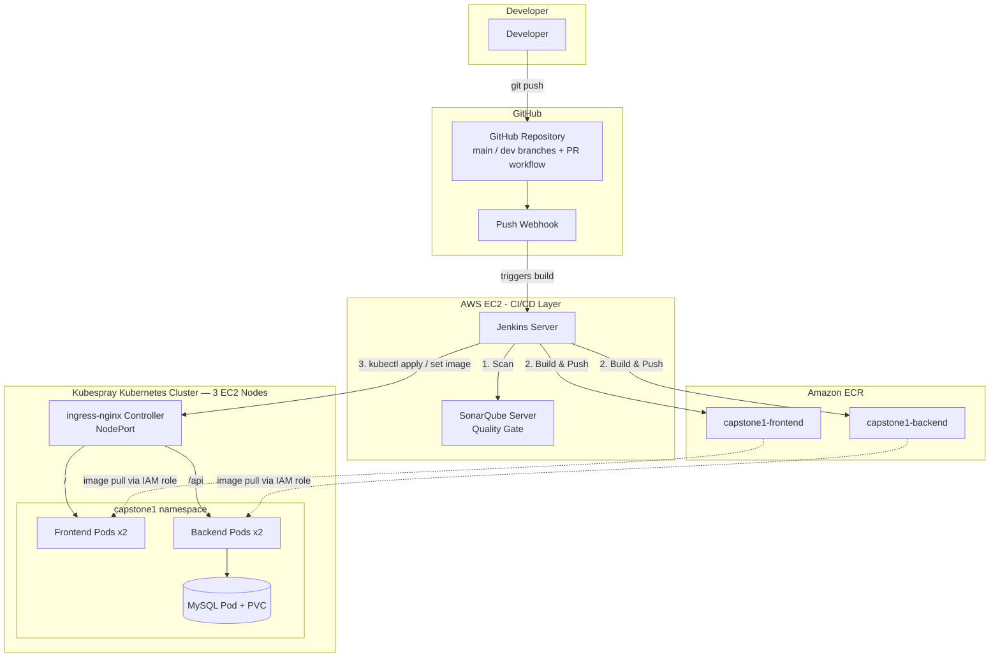

## CI/CD Pipeline Flow

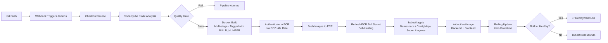

---

# 📷 Project Screenshots

## AWS Infrastructure

| IAM Role for ECR Access | ECR Repositories |
|--------------|-----------------|
| 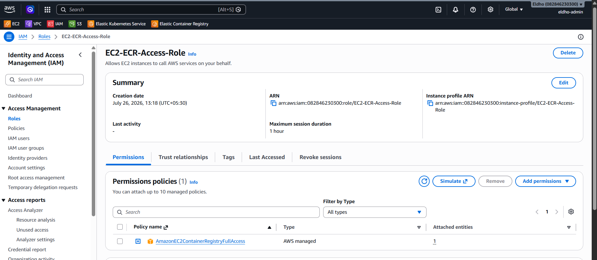 | 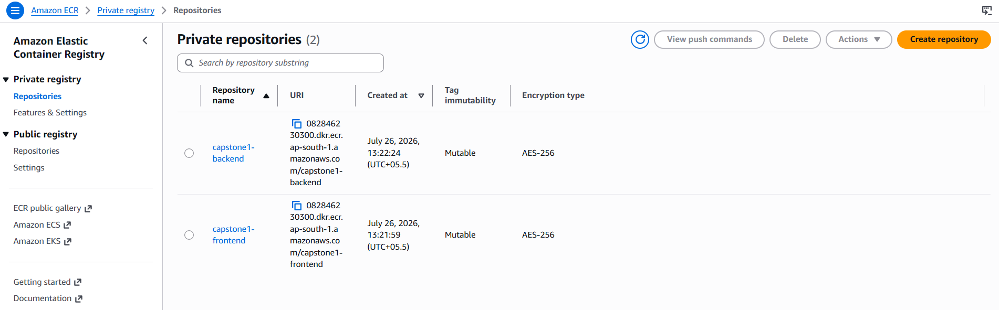 |

| 5 EC2 Instances Running | Security Group Rules |
|--------------|-----------------|
| 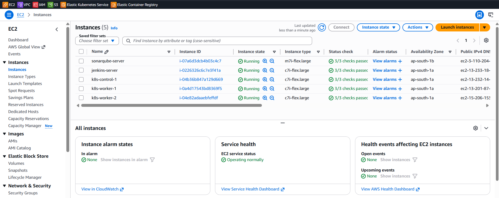 | 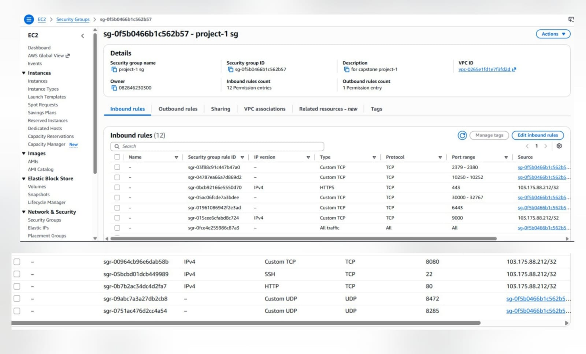 |

---

## Kubernetes Cluster

| Kubespray Bringing Up the Cluster | 3-Node Cluster Ready |
|-------|-------------|
| 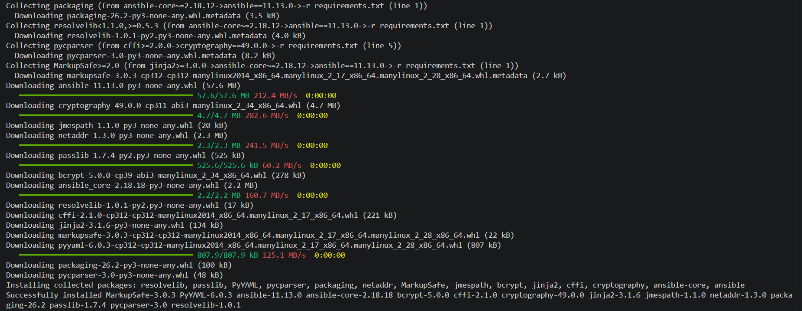 | 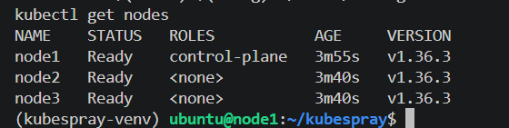 |

---

## CI/CD Tooling

| Jenkins Dashboard | SonarQube Project Setup |
|---------------------|-----------------|
| 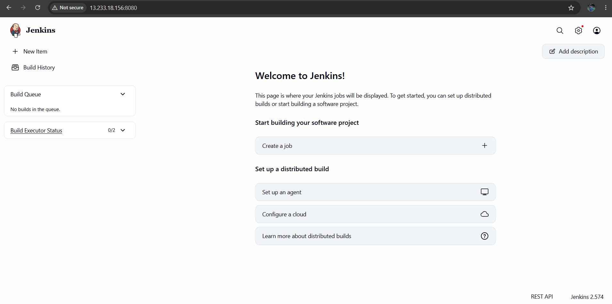 | 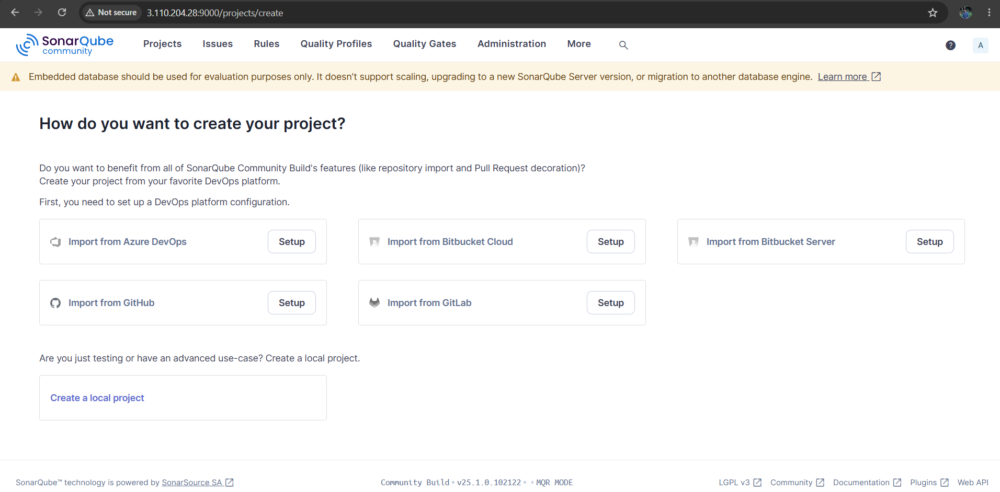 |

---

## Pipeline Runs

| Pipeline Stage View | Full Pipeline — All 6 Stages Passing |
|-----------|--------------|
| 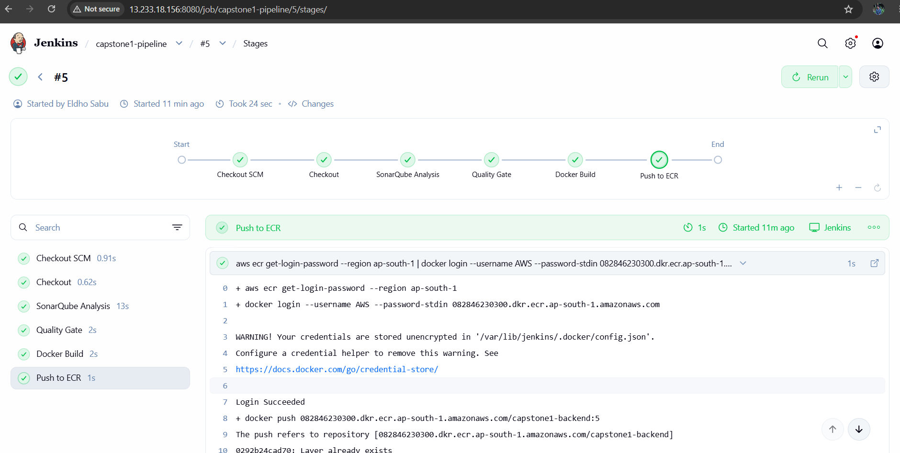 | 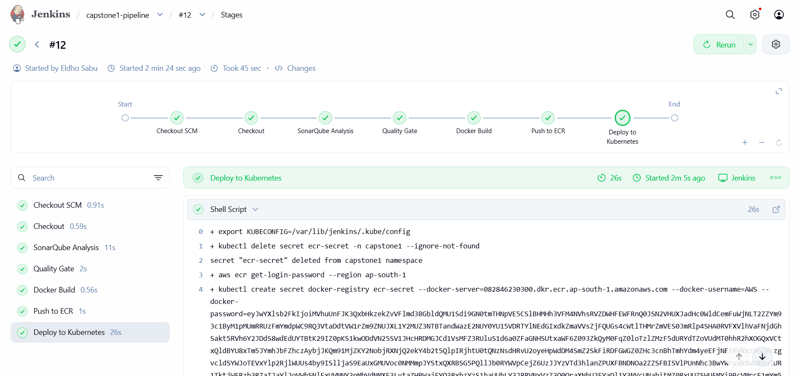 |

---

## Application & Rollback

| App Live on Kubernetes | Verified Rollback |
|-----------|--------------|
| 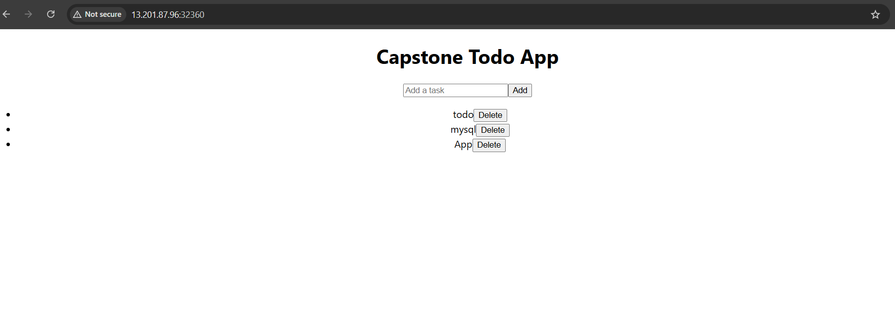 | 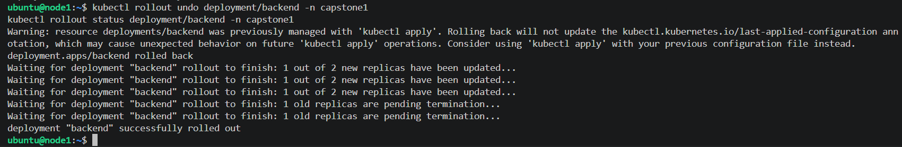 |

---

# ✨ Features

- GitHub source control with branching + real Pull Request workflow
- Jenkins Declarative Pipeline (Groovy) with GitHub webhook auto-trigger
- SonarQube static analysis — bugs, code smells, vulnerabilities, security hotspots
- Custom Quality Gate enforcing zero new bugs/vulnerabilities on every build
- Multi-stage Docker builds — small images, non-root users
- Amazon ECR registry — IAM role authentication, zero static credentials
- Self-healing pipeline — auto-refreshes expiring ECR pull secrets on every deploy
- Kubernetes Deployments, Services, ConfigMaps, Secrets, Ingress, PVC
- Resource requests/limits and readiness/liveness probes on every container
- Verified zero-downtime rolling updates
- Verified one-command rollback
- Production-style DevOps pipeline, built and debugged from scratch

---

# 🛠 Tech Stack

- AWS EC2, IAM, Security Groups
- Ubuntu 24.04
- Kubernetes v1.36
- Kubespray
- Ansible
- ingress-nginx
- Jenkins (Groovy Declarative Pipeline)
- SonarQube Community
- Docker
- Amazon ECR
- React
- Node.js / Express
- MySQL 8.0

---

# 📊 Components

| Component | Purpose |
|-----------|---------|
| GitHub | Source control, branching, PR workflow |
| Jenkins | CI/CD pipeline orchestration |
| SonarQube | Static code analysis & Quality Gate |
| Docker | Multi-stage application containerization |
| Amazon ECR | Private container image registry |
| Kubespray | Self-managed Kubernetes cluster deployment |
| ingress-nginx | Path-based routing into the cluster |
| React | Frontend UI |
| Node.js / Express | Backend REST API |
| MySQL | Application database |

---

# 🚀 Deployment Flow

1. Created AWS EC2 infrastructure (5 instances: 3-node K8s cluster, Jenkins, SonarQube)
2. Configured IAM role for EC2 → ECR access, created ECR repositories
3. Deployed Kubernetes using Kubespray across the 3 cluster nodes
4. Installed and linked Jenkins + SonarQube (webhook-based Quality Gate reporting)
5. Built the three-tier Todo app and validated it locally with Docker Compose
6. Wrote the Jenkinsfile: Checkout → SonarQube → Quality Gate → Docker Build → Push to ECR → Deploy to Kubernetes
7. Wrote Kubernetes manifests: Namespace, ConfigMap, Secret, Deployments, Services, Ingress, PVC
8. Verified rolling updates, zero-downtime, and rollback live on the cluster
9. Hardened the pipeline to self-heal expiring ECR tokens on every deploy

# 📈 Pipeline Workflow

GitHub Push

↓

Jenkins Webhook Trigger

↓

SonarQube Quality Gate

↓

Docker Build & Push to ECR

↓

Kubernetes Rolling Deployment

↓

Zero-Downtime Live App

---

# 🔧 Useful Commands

## Check Kubernetes Nodes

```bash
kubectl get nodes
```

## Check Application Pods

```bash
kubectl get pods -n capstone1
```

## Check Rollout Status

```bash
kubectl rollout status deployment/backend -n capstone1
```

## Trigger a Rollback

```bash
kubectl rollout undo deployment/backend -n capstone1
```

## Refresh the ECR Pull Secret Manually

```bash
kubectl delete secret ecr-secret -n capstone1 --ignore-not-found
kubectl create secret docker-registry ecr-secret \
  --docker-server=<account-id>.dkr.ecr.<region>.amazonaws.com \
  --docker-username=AWS \
  --docker-password=$(aws ecr get-login-password --region <region>) \
  --namespace=capstone1
```

---

# ✅ Zero-Downtime Verification

A continuous health-check loop was run against the app throughout a live rolling restart of the backend deployment:

```
200 200 200 200 200 200 200 200 200 200 200 200 200 200 200 200 200 200 ...
```

Not a single dropped request during the entire pod replacement cycle.

---

# 🐞 Troubleshooting

During deployment, several real production-style issues were identified and resolved:

- Jenkins repository signature failure — Jenkins had rotated its signing key; switched to the new key and repo path
- Jenkins service failed to start — required Java 21, only Java 17 was installed; fixed by installing and defaulting to `openjdk-21-jre`
- SonarQube crashed on startup (`SecurityManager` deprecation) — added `-Djava.security.manager=allow` to its JVM options
- `waitForQualityGate` timing out — no SonarQube → Jenkins webhook configured; added the webhook
- Backend/frontend pods stuck `ImagePullBackOff` — kubelet doesn't inherit the EC2 IAM role for ECR auth; created a `docker-registry` Secret from a short-lived ECR token
- MySQL PVC stuck `Pending` — Kubespray ships no default StorageClass; installed `local-path-provisioner`
- Frontend loaded but API calls failed — React build had a hardcoded `localhost` API URL; switched to relative paths
- API calls returned HTML 404s — an unnecessary Ingress `rewrite-target` annotation was mangling `/api` requests; removed it
- Backend intermittently failed DB queries — a single long-lived MySQL connection with no reconnect logic; switched to a connection pool
- SonarQube Quality Gate failing on IaC rules — Kubernetes manifests were missing resource requests/limits; added them to every container
- Accidentally staged a GitHub Personal Access Token in a commit — caught by GitHub's push protection before it reached the remote; removed via `git rm --cached` and an amended commit
- New pods failing `ImagePullBackOff` mid-pipeline — ECR tokens expire after 12 hours; made the pipeline self-healing by refreshing the pull secret on every deploy

These issues were diagnosed using Kubernetes, Docker, Jenkins, SonarQube, and Linux debugging techniques until the full pipeline ran green end-to-end.

---

# 📚 Lessons Learned

- Production CI/CD is as much about registry authentication and secret lifecycle management as it is about the pipeline stages themselves
- Kubernetes doesn't inherit cloud IAM roles automatically — image pull auth needs to be handled explicitly
- Quality Gates should reflect a project's actual scope, not be blindly accepted at default settings
- A rolling update is only "zero-downtime" once it's actually been verified live, not just assumed
- Self-healing pipelines (like automatic secret refresh) prevent entire categories of future failures
- Documenting real troubleshooting is more valuable than presenting a pipeline that "just worked"

# 🚀 Skills Demonstrated

- CI/CD Pipeline Design (Jenkins, Groovy)
- Kubernetes Administration (Kubespray)
- Static Code Analysis & Quality Gates (SonarQube)
- Docker Multi-Stage Builds
- AWS IAM & ECR Integration
- Ingress & Path-Based Routing
- Rolling Updates, Health Probes, Rollback
- Secret & Credential Lifecycle Management
- Linux & Networking Troubleshooting
- Infrastructure-as-Manifest (Kubernetes YAML)

---

# ⚠️ Known Limitations

- MySQL runs as a single replica, not a true HA StatefulSet — an accepted simplification for this project's scope
- SonarQube's Quality Gate excludes code coverage (would require a full test suite); a custom gate still enforces zero new bugs/vulnerabilities
- ECR pull secret refresh runs on every deploy rather than a separate schedule — simple and reliable at this project's scale

---

# 📷 Final Result

✔ Three-Tier Application Live on Kubernetes

✔ Full CI/CD Pipeline Passing End-to-End

✔ SonarQube Quality Gate Enforced

✔ Zero-Downtime Rolling Updates Verified

✔ Rollback Verified

✔ Self-Healing ECR Authentication

✔ Production-Style DevOps Pipeline Ready

---

# 👨‍💻 Author

**Eldho Sabu**

[](https://github.com/Eldho2827)
[](https://www.linkedin.com/in/eldhosabu08)

---
